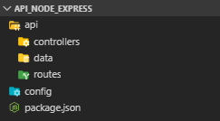

# API Node.js com Express e Nodemon

> **Autor: Vitor Migoto** / **Data: 01/05/2022**
------------
# Programas

- Node

# Passos para Instalação e Configuração da API

Prepara nosso projeto com arquivos de configuração de dependências

```jsx
npm init -y
```

## 1. Criação dos diretórios necessários



```jsx
./api/ => Contém nosso código da api.
./api/controllers/ => Contém todos controladores da api.
./api/data/ => Contém nossos mocks.
./api/routes/ => Contém as rotas da api.
./config/ => Contém as configurações do servidor.
./package.json => Listagem das dependências do projeto.
```

## 2. Instalação das dependências

```jsx
npm i -g nodemon && npm i --save express && npm i --save body-parser && npm i --save config && npm i --save cors
```

Nodemon → Pacote de Autoload do Server

Express → Pacote da API do Node.js

Body Parser → Pacote para conversão de dados em json

Config → Pacote para configuração de Variáveis de Ambiente

CORS → Configuração para acesso seguro

i → Install / - - save → Salvar o pacote

## 3. Criando Variáveis de Ambiente

Criar arquivo default.json na pasta config com os seguintes valores:

```jsx
{
  "server": {
      "port" : 3000
  }
}
```

## 4. Arquivo de Configuração do Express

Criar arquivo express.js dentro da pasta config com os seguintes valores:

```jsx
const express    = require('express');
const bodyParser = require('body-parser');
const config     = require('config');
const cors       = require('cors');

module.exports = () => {
  const app = express();

  // SETANDO VARIÁVEIS DA APLICAÇÃO
  app.set('port', process.env.PORT || config.get('server.port'));

  // MIDDLEWARES
  app.use(bodyParser.json());
	app.use(cors({
    origin: '*',
    methods: ['GET','POST','DELETE','UPDATE','PUT','PATCH']
  }));

  return app;
};
```

## 5. Criando arquivo do Servidor

Criar o arquivo server.js dentro da raiz do nosso projeto com os seguintes valores:

```jsx
const app = require('./config/express')();
const port = app.get('port');

// RODANDO NOSSA APLICAÇÃO NA PORTA SETADA
app.listen(port, () => {
  console.log(`Servidor rodando na porta ${port}`)
});
```

## 6. Criando script de Start do Servidor

No arquivo package.json vamos adicionar a seguinte linha do `start` abaixo na parte do scripts:

```jsx
"scripts": {
    **"start": "nodemon server",**
    "test": "echo \"Error: no test specified\" && exit 1"
  },
```

# Criando as Controladoras e as Rotas

## 1. Criando nossos dados de exemplo

Dentro da pasta api/data vamos criar o arquivo usuariosCredenciais.json com os seguintes itens.

```json
{
    "usuariosCredencial": {
        "data": [
            {
		            "id": "1",
		            "user": "vitormigoto",
		            "senha":"12345"
            },
            {
                "id": "2",
                "user": "joaocarlos",
                "senha":"123"
            }
        ]
    }
}
```

## 2. Criando a Controladora

Dentro da pasta api/controllers vamos criar um arquivo chamado usuariosCredenciais.js com o seguinte código:

```jsx
module.exports = () => {
    const credenciaisDB = require('../data/usuariosCredenciais.json');
    const controller = {};
  
    controller.listaCredenciais = (req, res) => res.status(200).json(credenciaisDB);
  
    return controller;
}
```

## 3. Criando a nossa Rota

Dentro da pasta api/routes vamos criar um arquivo chamado usuarios.js com o seguinte codigo:

```jsx
module.exports = app => {
    const controller = require('../controllers/usuariosCredenciais')();
  
    app.route('/api/lista/credenciais').get(controller.listaCredenciais);
}
```

### 4. Importando nossa Rota

Agora no arquivo config/express.js vamos adicionar a nossa rota que acabamos de criar colocando a seguinte linha próximo ao final do arquivo antes do return app;

```jsx
require('../api/routes/usuarios')(app);
```

O arquivo vai ficar assim:

```jsx
const express    = require('express');
const bodyParser = require('body-parser');
const config     = require('config');

module.exports = () => {
  const app = express();

	...

  **require('../api/routes/usuarios')(app);**

  return app;
};
```